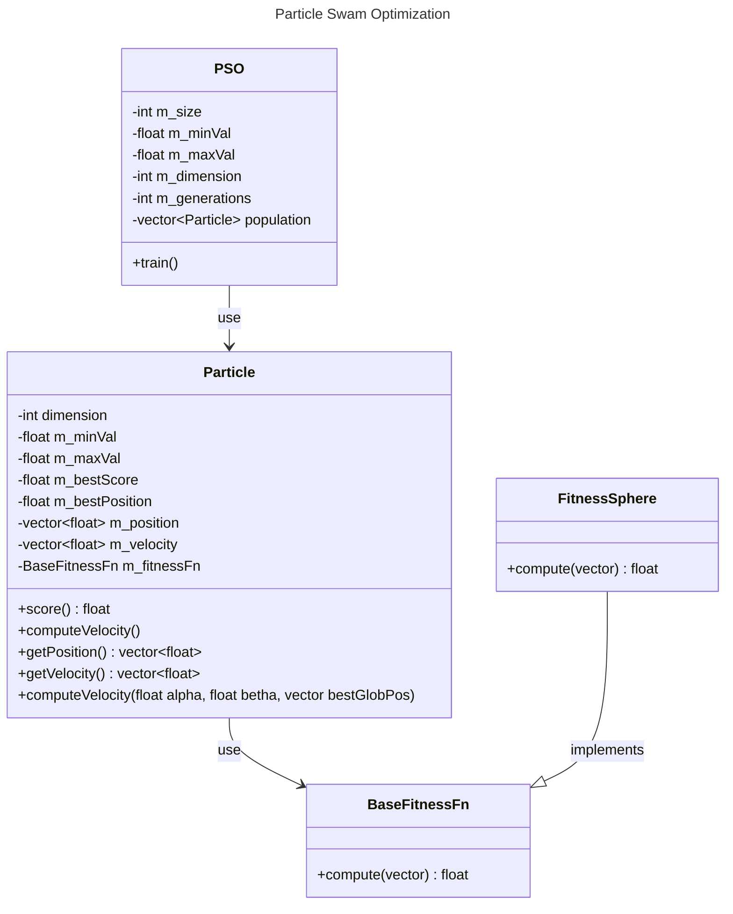

# PSO Project

## Diagram class

```mermaid
---
title: Particle Swam Optimization
---
classDiagram

    class PSO {
        -int m_size
        -float m_minVal
        -float m_maxVal
        -int m_dimension
        -int m_generations
        -vector~Particle~ population
        +train()
    }

    class Particle {
        -int dimension
        -float m_minVal
        -float m_maxVal
        -float m_bestScore
        -float m_bestPosition
        -vector~float~ m_position
        -vector~float~ m_velocity
        -BaseFitnessFn m_fitnessFn
        +score() float
        +computeVelocity()
        +getPosition() vector~float~
        +getVelocity() vector~float~
        +computeVelocity(float alpha, float betha, vector bestGlobPos)
    }

    class BaseFitnessFn {
        +compute(vector) float
    }

    class FitnessSphere {
        +compute(vector) float
    }

    Particle --> BaseFitnessFn: use
    FitnessSphere --|> BaseFitnessFn: implements
    PSO --> Particle: use

```
